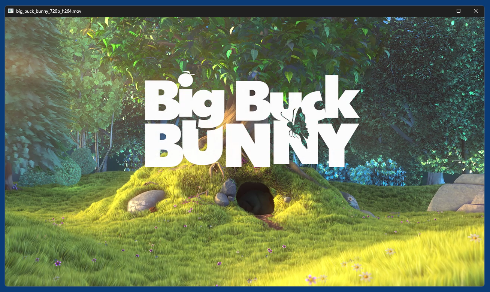
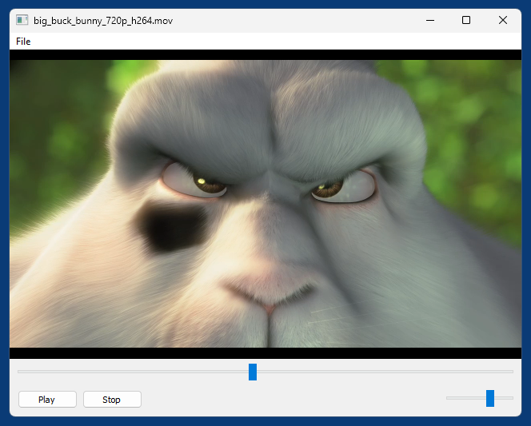

# python-dshow - DirectShow for Python

`python-dshow` is a Python package for Windows x64 that allows to quickly add Multimedia support to interactive GUI applications. Its core is a `Player` object that accepts any kind of window/control - anything that has a window handle (`HWND`) - and then renders video (if there is video, not just audio) into this window. The video is automatically resized whenever the size of this window changes.

Demos are provided for the following GUI toolkits:
- [PyQt5](demo_pyqt5.py)
- [PyQt6](demo_pyqt6.py)
- [PySide6](demo_pyside6/)
- [Tkinter](demo_tkinter.py)
- [Windows API](demo_winapi.py)
- [WinForms](demo_winforms.py) (Windows Forms, via [pythonnet](https://pypi.org/project/pythonnet/))
- [wxPython](demo_wxpython.py)  (wxWidgets)

`python-dshow` comes with a companion folder called `filters` that contains everything needed to load and play a variety of media file formats and codecs. DirectShow filters are loaded directly from the `.dll` files in this folder, so no filter registration needed, and no danger of [codec hell](https://en.wikipedia.org/wiki/DirectShow#Codec_hell).

General media support is based on the [LAV Filters](https://github.com/Nevcairiel/LAVFilters), which are in turn based on [FFmpeg](https://ffmpeg.org/). 

As Video renderer by default [MPC Video Renderer](https://github.com/Aleksoid1978/VideoRenderer) is used. 

Subtitles support is based on [VSFilter](https://github.com/v0lt/VSFilterBE) (DirectVobSub). Both internal (e.g. subtitle tracks in a `.mkv` file) and external (e.g. `.srt` or `.vtt` files) subtitle sources are supported.

MIDI support (`.mid` `.rmi` `.kar`) is based on [Bass Audio Source](https://github.com/v0lt/BassAudioSource), [BASSMIDI](https://www.un4seen.com/doc/#bassmidi/bassmidi.html) and a [SoundFont](https://en.wikipedia.org/wiki/SoundFont) file as GM soundbank. By default a rather [small SoundFont file](https://musical-artifacts.com/artifacts/5190) (3 MB, based on GM.dls that comes with Windows) called `soundbank.sf2` is loaded from the `filters` folder. For achieving better MIDI sound quality you can replace this file with a high-quality SoundFont file like e.g. [FluidR3_GM.sf2](https://musical-artifacts.com/artifacts/738) (141 MB) or [Reality_GMGS_falcomod.sf2](https://www.musical-artifacts.com/artifacts/6003) (34 MB).

E.g. for a frozen application the path to the `filters` folder can be changed like this:
```python
from dshow import DSHOW_SETTINGS, Player
DSHOW_SETTINGS.FILTER_DIR = "path\\to\\filters"
...
```

## Usage

### Minimal code, standalone mode:
```
python -m dshow big_buck_bunny_720p_h264.mov
```
Or alternatively:
```python
from dshow.standalone import Main

main = Main("big_buck_bunny_720p_h264.mov")
main.run()
```
*Result*  


### Player API

```python
__init__()
    parent_hwnd: int,
    volume: float = .75,  # 0..1
    auto_resize: bool = True,
    width: int = 0, height: int = 0,
)

load_media_file(media_file: str) -> bool
close_file()

play()
pause()
stop()

skip_back(secs: float)
skip_forward(secs: float)
step_back(frames: int)
step_forward(frames: int)

get_duration() -> float seconds
get_size() -> tuple
get_time() -> float seconds
get_volume() -> float  # 0..1

set_aspect_ratio(ratio: str)  # e.g. '4:3'
set_brightness(value: float)  # -1..1, 0=default
set_contrast(value: float)  # -1..1, 0=default
set_hue(value: float)  # -1..1, 0=default
set_loop(bool)
set_saturation(value: float)  # -1..1, 0=default
set_time(seconds: float)
set_volume(float)  # [0..1]

has_audio() -> bool
has_media() -> bool
has_video() -> bool

is_midi() -> bool
is_playing() -> bool
is_seekable -> bool

get_audio_tracks() -> list
get_sub_tracks() -> list
get_video_tracks() -> list

load_sub_file(sub_file: str) -> bool
hide_subtitles(bool)

select_audio_track(track_id: int)
select_sub_track(track_id: int)
select_video_track(track_id: int)

take_snapshot(bmp_file: str)

# Listen for native Windows messages
register_message_callback(msg: int, callback: callable)
unregister_message_callback(msg: int, callback: callable = None)
```

## Demos

All 7 demos implement basically the same application, a simple video player with the following features:
- Resizable window with menu bar
- Play/Pause and Stop buttons
- Position slider
- Volume slider
- Media files can be dropped from Explorer into the window
- Mouse click on video toggles play/pause state.
- Double-click on video toggles fullscreen mode.

*PyQt5 demo*  

